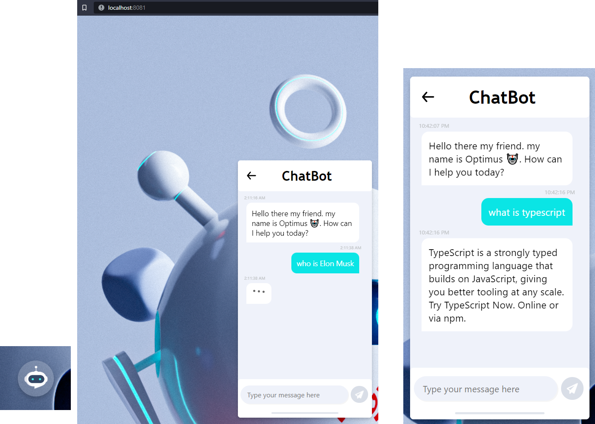

# reactChatbot

## Description

   A modern web chatbot widget extensible on any desirable website.

This project was developed using Typscript programming language and the React Library.

## Snippets



## Develop

install node dependecies :

```shell
npm install
```

run the widget on development server :

```shell
npm run dev
```

## Build

make sure to build project before entending it on your desired website. to build run :

```shell
npm run build
```

a javascript file will be generated after build is complete under the name "widget.bundle.js" " in the "dist" folder. exploit the index.html in your main web app to import the minified javascript file.

```html
<div id="chatbot"></div>
<script src="$path_to_widget.bundle.js"></script>
```

####

## Services

currently the chatbot fetches data from google search API but it can be tweaked to fetch from any provided API. test your service development :

```shell
npm run service
```

##

## Copyright

Logo was designed by hachem Ouanes. all copyright reserved to the author. if you want a vector version or ask any further questions contact me at : hachem.ouanes@gmail.com

As for the code it is open source under the MIT liscense.
